# MNPL — Economic Strategy Telegram Mini App

[English](README.md) | [Русский](README.ru.md)

> **An economic strategy game built as a Telegram Mini App with an asynchronous FastAPI backend, Aiogram bot, and PostgreSQL.**

---

## Project Overview

MNPL is a production-deployed economic strategy game running inside Telegram via the Telegram Mini Apps platform. Players manage virtual real estate districts, collect and upgrade cards, trade on a peer-to-peer marketplace, and receive automated daily passive yields.

* **~1,000** Registered Users
* **~100** Monthly Active Users (MAU)
* **~50** Daily Active Users (DAU)
* **Production Deployment**: Running on a single Linux VPS with automated background task scheduling
* **Platform**: Telegram WebApp (Mobile & Desktop)

---

## Links

- **Telegram Community**: https://t.me/mnplcoin
- **Telegram Bot**: https://t.me/mnplgamebot
---

## Engineering Highlights

- **Built 68 Vue components and 33 SPA routes** from scratch for the Telegram Mini App
- **Expanded backend to 52 REST endpoints** in FastAPI to support client-side gameplay
- **Implemented concurrency-safe asset allocation and balance operations** using PostgreSQL row-level locking
- **Implemented bilingual localization architecture** (RU/EN) across client and server
- **Developed custom Telegram WebView navigation** and container-specific scroll restoration

---

## Screenshots & Interface

*Captures from the production Telegram Mini App.*

| 1. Home Dashboard | 2. Inventory & Cards |
| :---: | :---: |
| 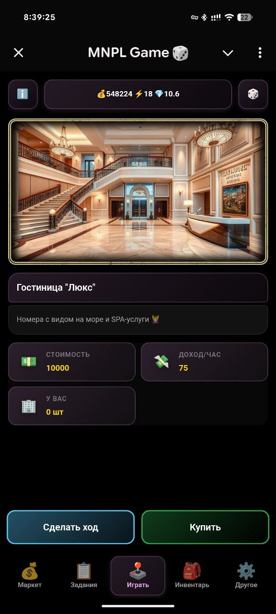 *Player balances, energy indicator, and core gameplay* | 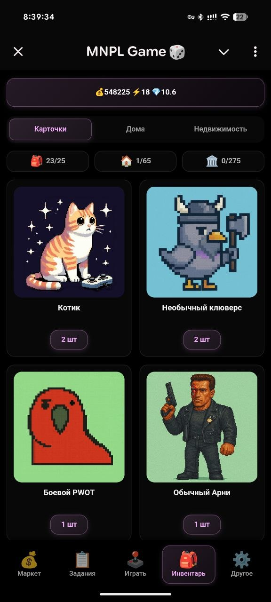 *Card collection gallery with rarity filters and stats* |

| 3. Real Estate V2 | 4. P2P Marketplace |
| :---: | :---: |
| 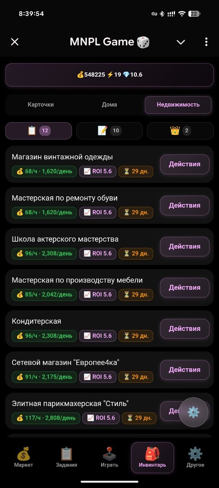 *District exploration, property acquisition, and upgrades* | 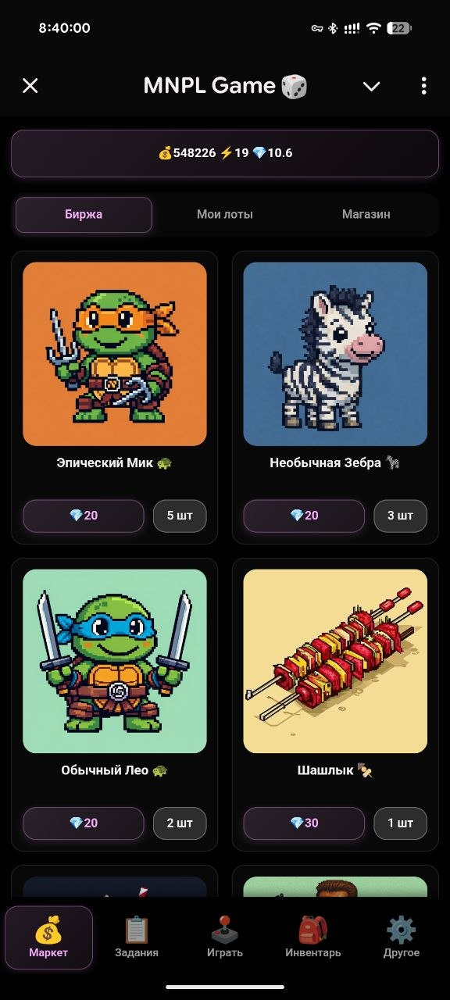 *Decentralized player trading board and active orders* |

| 5. Card Detail & Upgrades | 6. Leaderboard |
| :---: | :---: |
| 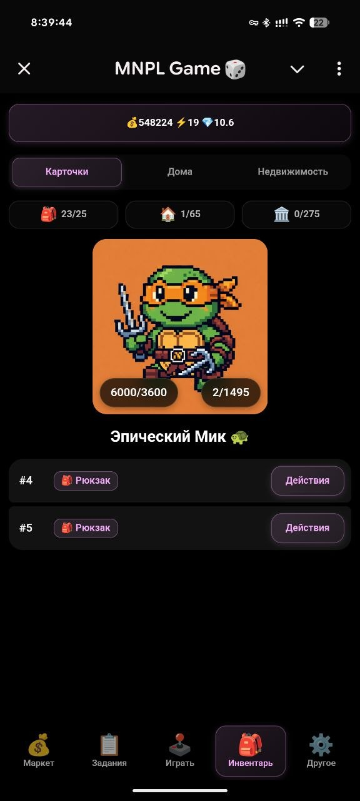 *Collectible card attributes and fusion requirements* | 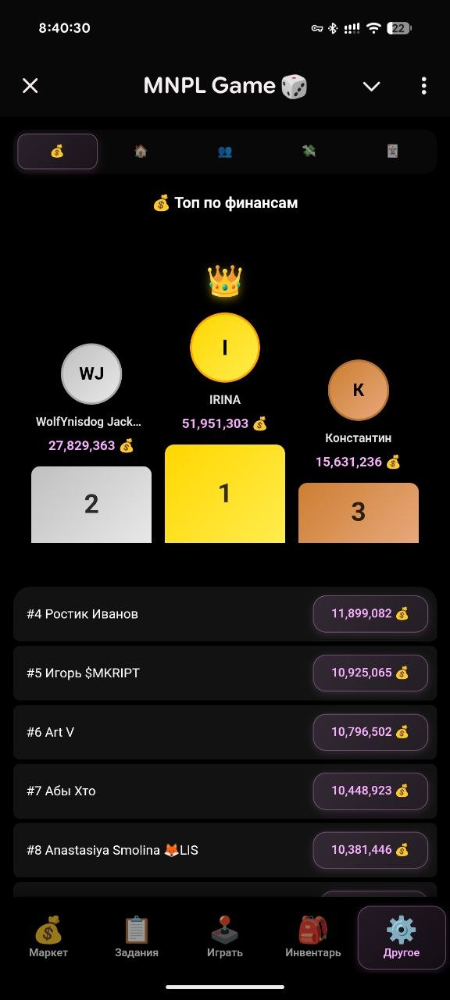 *Global player ranking by net worth and active streaks* |

| 7. Referral Program | 8. Quests & Tasks |
| :---: | :---: |
| 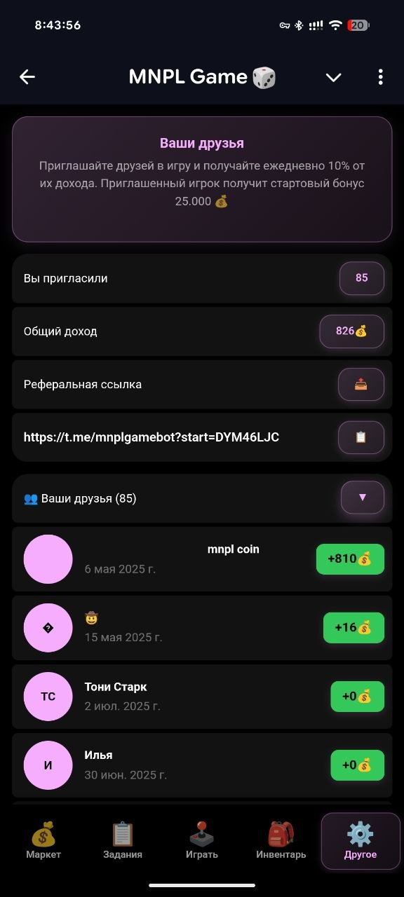 *Referral network statistics and friend invite tracking* | 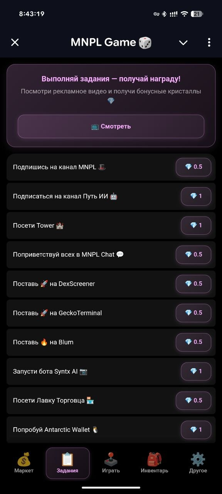 *Daily quest system and player reward progression* |

| 9. Daily Bonuses | 10. Profile & Settings |
| :---: | :---: |
| 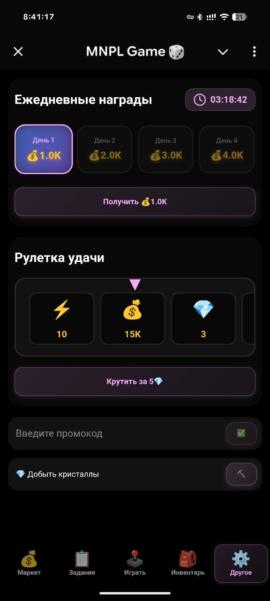 *Consecutive check-in rewards calendar* | 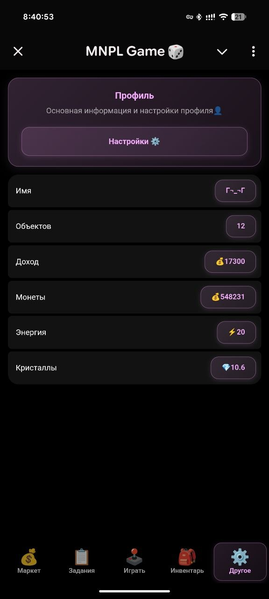 *Account overview, navigation menu, and language toggles* |

---

## Features

### 1. Collectible Asset & Upgrade System
* Visual catalog of collectible cards organized into thematic series and rarity tiers.
* Multi-card fusion algorithm: combining 5 duplicate cards into higher-tier editions with boosted attributes.
* Card recycling mechanic: converting surplus assets into premium hard currency.

### 2. Dynamic Real Estate & Districts (Realty V2)
* District-based property ownership with progression incentives.
* Completion multiplier: owning entire district sets increases total passive yield.
* Structural upgrades: building residential houses on acquired parcels to scale rental returns.

### 3. P2P Marketplace & Trading
* Player-to-player order book for buying and selling rare collectible cards.
* In-game store for functional utility items and progression boosts.
* Database-level atomic transactions for item and currency transfers to prevent partial state updates.

### 4. Automated Daily Yield & Economy
* Automated background scheduler calculating daily payouts based on portfolio size and active holdings.
* Automated daily yield adjustment based on scheduled token valuation calculations.

### 5. Multilingual Support (i18n)
* Complete localization for English and Russian across all UI flows, dialogs, and notifications.
* Language preference synchronization across frontend client and backend profile storage.

### 6. Gamification & Retention
* Consecutive daily check-in calendar with escalating rewards.
* Interactive lucky roulette spin with randomized drop tables.
* Milestone achievement system rewarding gameplay progression.

---

## My Role

> **"Joined the project when core gameplay existed exclusively as Telegram Bot chat interactions."**

### Pre-existing Project Baseline (What was already there)
* Initial Telegram Bot service on Aiogram
* Baseline PostgreSQL schema (user entities, basic dice logic, initial balance ledger)
* Interaction loop conducted via Telegram inline keyboards and chat replies

### My Direct Contributions (What I designed and built)
* **Telegram Mini App (0 → 1)**: Conceived, architected, and built the entire Vue 3 SPA client from scratch
* **Frontend Application**: Delivered all 68 Vue components, 33 SPA routes, and mobile-first touch UI
* **Backend Modernization**: Expanded the backend into a 52-endpoint FastAPI REST service to serve the SPA
* **Game Mechanics V2**: Engineered the Card Upgrade/Fusion algorithm, Card Burning, and Realty V2 mechanics
* **Database Evolution**: Authored PostgreSQL migrations (001–007), adding row locks and query indexes
* **Full Localization**: Designed and implemented end-to-end bilingual support (RU/EN) across client and API
* **WebView UX Engineering**: Resolved Telegram-specific touch scroll clipping and route state preservation

---

## My Impact

* **Shifted Core UX from Bot to WebApp**: Transformed deep nested chat menus into an intuitive dashboard, eliminating message rate-limit delays during active gameplay.
* **Decoupled Client & Server Workloads**: Moving interactive gameplay to a dedicated REST service allowed concurrent users to browse inventory and trade without saturating the bot polling loop.
* **Shipped Bilingual Support (RU/EN)**: Built an end-to-end localization architecture across client and server, enabling international user onboarding.
* **Delivered Core Retention Loops (Realty V2 & Fusion)**: Implemented multi-tier card upgrades and progressive real estate mechanics, providing long-term progression goals for daily players.
* **Eliminated Race Conditions in Trades**: Applied row-level locking (`SELECT ... FOR UPDATE`) in critical purchase and fusion operations, preventing double-spending and inventory discrepancies.
* **Resolved Mobile WebView Quirks**: Implemented container-targeted scroll restoration and local caching to eliminate UI flickers and page resets inside Telegram's embedded browser.

---

## Technical Decisions

### Why asyncpg instead of SQLAlchemy?
* **Explicit SQL Control**: Complex game calculations (progressive yields, multi-table condition checks, and district bonuses) are significantly clearer and easier to tune in raw, parameterized SQL.
* **Targeted Locking**: Critical trading operations required explicit `FOR UPDATE` row locks to prevent race conditions during card exchanges. Writing these directly in SQL avoids ORM abstraction overhead and unexpected query generation.
* **Minimal Latency**: Connecting directly via an `asyncpg.Pool` eliminates ORM serialization layers, keeping request overhead low on single-node hardware.

### Why Vue Composables instead of Pinia?
* **Bundle Size Optimization**: In a mobile Telegram Mini App, initial loading speed is critical. Avoiding extra store libraries kept the bundle lightweight.
* **Feature-Scoped State**: Game state naturally splits into independent domains (user session, inventory, market, tasks). Encapsulating state in composables with a lightweight `localStorage` TTL cache provided sufficient reactivity without centralized store boilerplate.

### Why a Telegram Mini App instead of continuing with Bot UI?
* **Telegram Bot Limitations**: Complex inventory management with dozens of cards and multi-tier properties requires extensive scrolling and pagination in chat messages, hitting Telegram API rate limits during quick taps.
* **Rich Interactions**: Mini Apps provide visual asset grids, animated dialogs, instant tab transitions, and touch gestures that are fundamentally impossible in text-based chats.

### Why a separate REST API alongside the Bot?
* **Decoupling Responsibilities**: The Telegram Bot continues to handle user onboarding, command parsing, and system alerts via long polling. The FastAPI REST service handles high-frequency HTTP requests from the Mini App.
* **Shared Persistence**: Both services connect to the same PostgreSQL database, ensuring unified progression whether an action originates in chat or inside the WebApp.

---

## Architecture

High-level architecture illustrating the separation between client layers, backend services, and persistence:

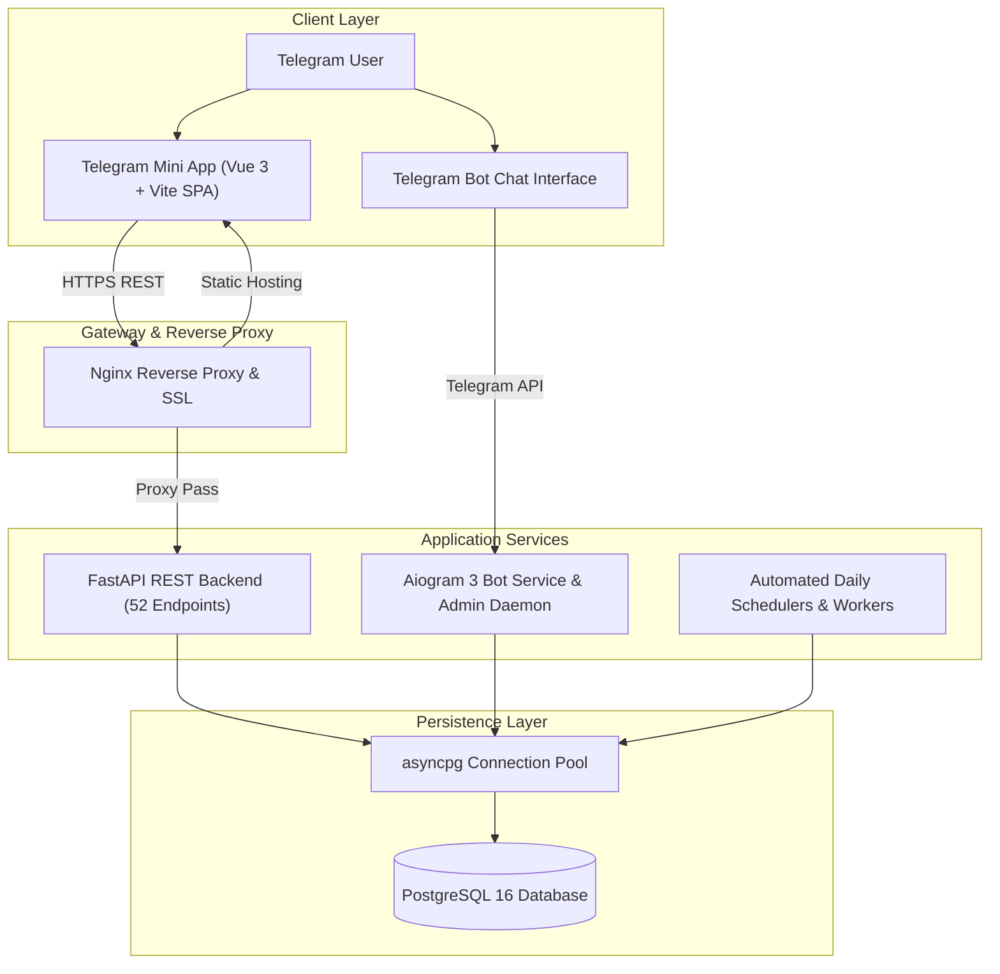

---

## Technology Stack

### Frontend
* **Framework**: [Vue 3](https://vuejs.org/) (Composition API, `<script setup>`)
* **Language**: [TypeScript 5](https://www.typescriptlang.org/)
* **Tooling**: [Vite 5](https://vitejs.dev/)
* **Routing & State**: [Vue Router 4](https://router.vuejs.org/), Custom Reactive Composables with TTL caching
* **Internationalization**: [vue-i18n 11](https://vue-i18n.intlify.dev/) (EN / RU localization)
* **Networking**: [Axios](https://axios-http.com/) with request signing and localization interceptors
* **Telegram Integration**: Telegram WebApp SDK abstraction layer
* **Component Showcase**: [Storybook 10](https://storybook.js.org/), [Vitest](https://vitest.dev/)

### Backend
* **API Framework**: [FastAPI](https://fastapi.tiangolo.com/) (Python 3.11+, ASGI / Uvicorn)
* **Bot Framework**: [Aiogram 3.18](https://aiogram.dev/) (Telegram Bot Framework)
* **Database Driver**: [asyncpg](https://github.com/MagicStack/asyncpg) (Asynchronous PostgreSQL client)
* **Task Automation**: [APScheduler](https://apscheduler.readthedocs.io/) (Automated economic distributions and maintenance)
* **Analytics**: Pandas, Matplotlib, ReportLab (Automated administrative reports)
* **Validation**: Pydantic v2

### Database & Operations
* **Database**: PostgreSQL 16
* **Concurrency**: Row-level locking (`FOR UPDATE`) for atomic asset trades
* **Migrations**: Versioned SQL migration runners
* **Hosting**: Linux Cloud VPS (Nginx + Systemd services)

---

## Technical Challenges & Solutions

### 1. Decoupling Bot Interactions into a Responsive Mini App
* **Challenge**: The original gameplay relied on Telegram chat messages, inline keyboards, and callback queries. This created rate limits, disjointed state, and rigid UX.
* **Solution**: Designed a decoupled architecture where the existing database and bot service remained operational while a FastAPI REST service and Vue 3 Mini App were built in parallel. Both interfaces operate simultaneously against the same PostgreSQL database.

### 2. Preventing Race Conditions in Concurrent Transactions
* **Challenge**: Concurrent operations (such as simultaneous attempts to buy the same marketplace listing or rapid card upgrade clicks) risked duplicate grants or double-spending.
* **Solution**: Enforced PostgreSQL transaction isolation with row-level locks on inventory and balance records within atomic `asyncpg` transactions, ensuring consistent state without table-level lock bottlenecks.

### 3. Telegram WebView Touch & Navigation Quirks
* **Challenge**: The embedded mobile Telegram WebView has non-standard touch scrolling, pull-to-refresh collisions, and unmounts pages during tab changes.
* **Solution**: Built a custom navigation stack and component-targeted scroll restoration mechanism that tracks container-specific scroll offsets, delivering a native-feeling mobile experience.

### 4. Coordinated Multilingual Architecture
* **Challenge**: Synchronizing translation updates between client UI strings and backend notifications without data divergence.
* **Solution**: Established a unified localization dictionary system with language-tagged request interceptors on Axios and corresponding translation resolvers in FastAPI.

---

## Project Metrics

* **Database Tables**: 51 tables
* **API Endpoints**: 52 REST endpoints
* **Client Routes**: 33 SPA routes
* **Client Components**: 68 Vue components
* **Project Files**: 440+ tracked files

---

## Technical Debt & Future Improvements

* **Docker-Based Environments**: Introduce Docker Compose configurations for seamless local onboarding and isolated testing environments.
* **Database Migrations Tooling**: Transition from custom versioned SQL migration runners to Alembic for automated schema diffing and safer rollbacks.
* **Automated Testing & CI/CD**: Add integration test suites for core financial flows and configure GitHub Actions for automated linting and zero-downtime deployment pipelines.

---

## Project Status

* 🟢 **Production Deployed**: Actively operating with daily transactional volume.
* 👥 **Active Community**: Daily engagement through automated distributions and marketplace trading.
* 🔄 **Modular Architecture**: Feature-scoped modules (Inventory, Market, Realty) separated for targeted updates.

---

## License

Copyright (c) 2026 MOneK. All rights reserved.

This repository contains documentation, screenshots, and showcase materials only. No permission is granted to copy, modify, distribute, or use any part of this project without explicit written permission.