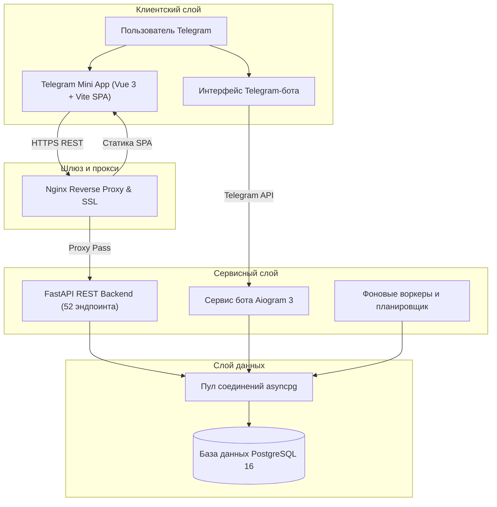

# MNPL — Экономическая стратегия (Telegram Mini App)

[English](README.md) | [Русский](README.ru.md)

> **Экономическая игра, реализованная как Telegram Mini App с асинхронным бэкендом на FastAPI, ботом на Aiogram и базой данных PostgreSQL.**

---

## О проекте

MNPL — это развернутая в продакшене экономическая стратегия, работающая напрямую внутри Telegram на платформе Telegram Mini Apps. Игроки развивают виртуальные районы недвижимости, собирают и улучшают коллекционные карточки, торгуют на P2P-маркете и ежедневно получают автоматический пассивный доход.

* **~1,000** зарегистрированных пользователей
* **~100** активных пользователей в месяц (MAU)
* **~50** активных пользователей в день (DAU)
* **Продакшен-деплой**: работает на выделенном Linux VPS с автоматическим выполнением фоновых задач
* **Платформа**: Telegram WebApp (мобильная и десктопная версии)

---

## Ключевые инженерные результаты (Highlights)

- **Разработал с нуля 68 Vue-компонентов и 33 SPA-маршрута** для Telegram Mini App
- **Расширил бэкенд до 52 REST-эндпоинтов** на FastAPI для поддержки клиентского интерфейса
- **Реализовал безопасное распределение активов и балансовых операций** с защитой от гонок через построчные блокировки PostgreSQL
- **Спроектировал архитектуру полной локализации** (RU/EN) на клиенте и сервере
- **Реализовал кастомную навигацию и постраничное сохранение скролла** с учетом специфики Telegram WebView

---

## Скриншоты интерфейса

*Интерфейс боевой версии Telegram Mini App.*

| 1. Главный экран | 2. Инвентарь и коллекции |
| :---: | :---: |
|  *Балансы игрока, индикатор энергии и основная навигация* |  *Галерея коллекционных карт с фильтрами редкости и статами* |

| 3. Недвижимость V2 | 4. P2P Маркетплейс |
| :---: | :---: |
|  *Карта районов, покупка участков и уровни улучшений* |  *Пользовательская доска объявлений и активные ордера* |

| 5. Лидерборд | 6. Профиль и настройки |
| :---: | :---: |
|  *Глобальный рейтинг игроков по капиталу и активности* |  *Игровая статистика, реферальная программа и выбор языка* |

---

## Игровой функционал

### 1. Коллекционные карточки и система улучшений
* Визуальный каталог карт по тематическим сериям и уровням редкости.
* Алгоритм слияния: объединение 5 одинаковых карт в старшую ступень с повышенными характеристиками.
* Механика сжигания (утилизации): обмен карт на премиальную валюту (кристаллы).

### 2. Недвижимость и районы (Realty V2)
* Районная система владения объектами с мотивацией сбора полных сетов.
* Множитель района: сбор всех объектов локации увеличивает суммарный пассивный доход.
* Постройка домов на выкупленных участках для масштабирования арендной доходности.

### 3. P2P Маркетплейс и магазин
* Пользовательская книга заявок на покупку и продажу редких карт.
* Внутриигровой магазин с расходными предметами и бустерами.
* Атомарные транзакции на уровне базы данных для исключения частичного перевода активов.

### 4. Автоматический пассивный доход
* Фоновое начисление дохода раз в сутки по расписанию в зависимости от активов игрока.
* Автоматическая корректировка ежедневных выплат на основе рыночной оценки токена.

### 5. Мультиязычность (i18n)
* Полная локализация интерфейса, диалогов и уведомлений на русский и английский языки.
* Синхронизация выбранного языка между клиентом и профилем на сервере.

### 6. Удержание и геймификация
* Календарь ежедневных наград за регулярный вход в игру.
* Интерактивная рулетка с вероятностным распределением призов.
* Многоуровневые достижения за торговлю, крафт и коллекционирование.

---

## Моя роль в проекте

> **"Подключился к проекту, когда весь геймплей был реализован исключительно в формате чат-бота Telegram."**

### Исходное состояние проекта (что уже было):
* Работающий Telegram-бот на базе Aiogram;
* Базовая схема PostgreSQL (пользователи, логика бросков кубика, начальные балансы);
* Игровой процесс через inline-кнопки и текстовые сообщения в чате.

### Мой личный вклад (что спроектировал и создал я):
* **Telegram Mini App (с нуля)**: спроектировал и с нуля разработал клиентское SPA-приложение на Vue 3, переведя игру в полноценный мобильный интерфейс;
* **Фронтенд**: реализовал 68 компонентов, 33 маршрута и адаптивную верстку;
* **Модернизация бэкенда**: расширил существующий API до 52 REST-эндпоинтов на FastAPI для работы SPA;
* **Новые механики (V2)**: разработал алгоритмы слияния и сжигания карт, систему недвижимости Realty V2;
* **Эволюция базы данных**: написал миграции PostgreSQL (001–007), внедрил блокировки строк и индексы;
* **Интернационализация**: реализовал сквозную двуязычную поддержку (RU/EN) на клиенте и сервере;
* **Оптимизация WebView**: устранил проблемы со скроллом и сохранением состояния экрана при навигации в Telegram.

---

## Мое влияние на продукт (My Impact)

* **Перевод UX из чата в WebApp**: устранил задержки и ограничения Telegram Bot API (HTTP 429), заменив длинные цепочки кнопок на удобный графический дашборд.
* **Разделение клиентских и серверных нагрузок**: вынесение частых действий в отдельный REST-сервис позволило игрокам активно просматривать инвентарь и маркет без перегрузки поллинга бота.
* **Выход на международную аудиторию**: полноценная поддержка английского и русского языков открыла доступ к зарубежным игрокам.
* **Внедрение долгосрочных игровых циклов**: запуск Realty V2 и слияния карт сформировал мотивацию для регулярного ежедневного входа.
* **Надежность транзакций**: применение блокировок строк (`FOR UPDATE SKIP LOCKED`) в критических операциях исключило возможность повторного списания или дублирования карт при одновременных кликах.
* **Плавная работа в мобильном WebView**: специализированное кэширование и фиксация скролла по конкретным контейнерам обеспечили поведение нативного мобильного приложения.

---

## Архитектурные решения (Technical Decisions)

### Почему asyncpg вместо SQLAlchemy?
* **Прямой контроль SQL**: сложные игровые расчеты (прогрессивный доход, множественные условия наборов) значительно прозрачнее и проще оптимизировать на чистом параметризованном SQL.
* **Точечные блокировки**: для операций начисления дропов и списания балансов требовались явные блокировки строк (`FOR UPDATE`), что проще и надежнее контролировать без абстракций ORM.
* **Минимальный оверхед**: прямое подключение через пул `asyncpg` обеспечивает минимальные задержки без накладных расходов на сериализацию моделей.

### Почему Vue Composables вместо Pinia?
* **Экономия размера бандла**: для мобильного Mini App критична скорость первоначальной загрузки, отказ от внешней библиотеки стейт-менеджмента помог облегчить приложение.
* **Изолированное состояние**: игровое состояние разделено по доменам (сессия, инвентарь, маркет, задачи); композиции с локальным TTL-кэшированием в `localStorage` закрыли все потребности реактивности.

### Почему Telegram Mini App вместо Bot UI?
* **Ограничения чат-ботов**: отображение десятков карт и многоуровневых параметров в сообщениях чата приводило к спаму кнопками и упиралось в лимиты Telegram API.
* **Богатый интерфейс**: веб-приложение дает визуальную сетку карточек, диалоговые окна, мгновенное переключение вкладок и тач-управление.

### Почему отдельный REST API рядом с ботом?
* **Разделение ответственности**: бот обрабатывает входящие команды, авторизацию и системные алерты, а FastAPI обслуживает частые HTTP-запросы от веб-приложения.
* **Единая база данных**: оба сервиса подключены к общей базе PostgreSQL, сохраняя синхронность профиля независимо от точки входа.

---

## Архитектура системы

---

## Стек технологий

### Frontend
* **Фреймворк**: [Vue 3](https://vuejs.org/) (Composition API, `<script setup>`)
* **Язык**: [TypeScript 5](https://www.typescriptlang.org/)
* **Сборщик**: [Vite 5](https://vitejs.dev/)
* **Маршрутизация**: [Vue Router 4](https://router.vuejs.org/), кастомные реактивные composables с TTL-кэшированием
* **Локализация**: [vue-i18n 11](https://vue-i18n.intlify.dev/) (RU / EN)
* **Сеть**: [Axios](https://axios-http.com/) с интерцепторами подписи и локали
* **Интеграция с Telegram**: Telegram WebApp SDK
* **Компонентная среда**: [Storybook 10](https://storybook.js.org/), [Vitest](https://vitest.dev/)

### Backend
* **API фреймворк**: [FastAPI](https://fastapi.tiangolo.com/) (Python 3.11+, ASGI / Uvicorn)
* **Фреймворк бота**: [Aiogram 3.18](https://aiogram.dev/)
* **Драйвер БД**: [asyncpg](https://github.com/MagicStack/asyncpg) (асинхронный клиент PostgreSQL)
* **Планировщик задач**: [APScheduler](https://apscheduler.readthedocs.io/)
* **Аналитика и отчеты**: Pandas, Matplotlib, ReportLab
* **Валидация**: Pydantic v2

### База данных и инфраструктура
* **СУБД**: PostgreSQL 16
* **Конкурентность**: построчные блокировки (`FOR UPDATE`) для атомарности операций
* **Миграции**: версионированные SQL-скрипты миграций
* **Хостинг**: Linux Cloud VPS (Nginx + Systemd сервисы)

---

## Метрики проекта

* **Таблицы БД**: 51 таблица
* **REST эндпоинты**: 52 эндпоинта
* **SPA маршруты**: 33 маршрута
* **Vue-компоненты**: 68 компонентов
* **Файлы проекта**: 440+ отслеживаемых файлов

---

## Технический долг и планы развития (Roadmap)

* **Контейнеризация**: внедрение Docker Compose для упрощения локального развертывания и изоляции тестовых сред;
* **Инструменты миграций**: переход с кастомных SQL-скриптов на Alembic для автогенерации схем и безопасных откатов;
* **Автоматизация тестирования и CI/CD**: расширение интеграционных тестов для критических операций и настройка GitHub Actions.

---

## Статус проекта

* 🟢 **В продакшене**: сервис стабильно работает и обслуживает пользователей;
* 👥 **Активное сообщество**: регулярная игровая активность и торговля на маркете;
* 🔄 **Модульная структура**: кодовая база разделена по доменным модулям для удобного добавления новых фичей.

---

## Лицензия

Copyright (c) 2026 MOneK. Все права защищены.

Данный репозиторий содержит исключительно демонстрационные материалы, скриншоты и документацию. Копирование, модификация, распространение или использование любой части проекта без прямого письменного разрешения запрещены.