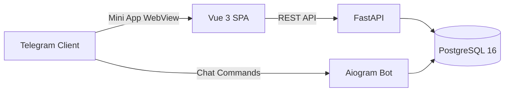

# Technical Case Study: MNPL Telegram Ecosystem

## Executive Summary
This case study details the technical transition of **MNPL** from a Telegram-bot-driven game into a Telegram Mini App backed by a FastAPI service, Aiogram bot, and a shared PostgreSQL persistence layer.

---

## 1. Background & Architectural Evolution

### Initial State: Bot-Only Interaction
* Gameplay logic was invoked via Telegram inline keyboards and chat messages.
* Bot API message limits created artificial latency during concurrent user spikes.
* Complex nested menus created navigation friction on mobile devices.

### Target State: Decoupled WebApp Architecture
* **Frontend**: Responsive Vue 3 Single Page Application embedded directly inside Telegram WebView.
* **Backend**: Asynchronous REST API (FastAPI) running concurrently with the existing bot daemon.
* **Data Layer**: Centralized PostgreSQL database shared across both interfaces, ensuring unified progression and account parity.

---

## 2. Engineering Challenges & Delivered Solutions

### High-Concurrency Asset Allocation & Transactions
* **Problem**: Simultaneous user actions (such as rapid reward claims, card drops, or concurrent balance deductions) risk race conditions, phantom reads, and double-allocation of digital assets.
* **Solution**: Implemented transactional row-level locks (FOR UPDATE on balance records and FOR UPDATE SKIP LOCKED on card allocation pools) within atomic database transactions, preventing state conflicts without incurring global table-lock penalties.

### State & Scroll Management in Mobile WebView
* **Problem**: The embedded Telegram WebView environment does not handle browser history and container-level scroll restoration naturally.
* **Solution**: Engineered a custom navigation stack composable that caches scroll positions for specific virtualized list containers, delivering smooth, flicker-free transitions when navigating between deep inventory and market views.

### Synchronized Client-Server Localization
* **Problem**: A bilingual experience requires continuous alignment between client-rendered UI elements and backend-triggered push notifications.
* **Solution**: Unified translation keys with request-level language headers in Axios and server-side locale resolvers, ensuring instant UI language toggling without full app reloads.

### Client-Side Caching Strategy
* **Problem**: Frequent tab switching in mobile WebViews can trigger redundant network requests for static game data.
* **Solution**: Implemented a lightweight client-side TTL caching layer using `localStorage` for catalogs (achievements, districts, card collections), reducing unnecessary network payload.